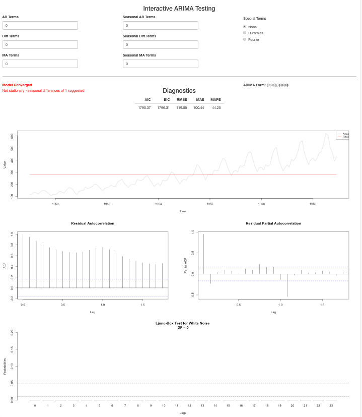

<!-- README.md is generated from README.Rmd. Please edit that file -->

# aRima.helper

<!-- badges: start -->

<!-- badges: end -->

Simplifies ARIMA modeling by providing a user interface and immediate
results. User can specify non-seasonal and or/seasonal AR, MA, and
difference terms as well as dummy & Fourier terms. Stationarity test,
model convergence, fit statistics, ACF & PACF plots, residual plots, and
white noise plots all provided. This package heavily uses the ‘forecast’
package by Rob Hyndman.

## Install

To install from github

``` r
install.packages("devtools")
devtools::install_github("kevcraig/aRima.helper")
```

To load once installed

``` r
library(aRima.helper)
```

## Usage

By default, the aRima\_helper function will return a local shiny app
based on the time-series provided.

### Non-seasonal time-series

The most simple case. If a time-series object with no frequency is
provided, a non-seasonal shiny app will be returned with inputs for AR,
MA, and difference terms.

Example withW `WWusage` from `datasets`

``` r
library(aRima.helper)
aRima_helper(WWWusage)
```


### Seasonal time-series

If a time-series object with a frequency is provided, a seasonal shiny
app will be returned with inputs for AR, MA, difference, seasonal AR,
seasonal MA, and seasonal difference terms. You can also specify special
terms such as dummies or Fourier. The amount of Fourier terms used is
equal to frequency/2.

Example with `AirPassengers` from `datasets`

``` r
library(aRima.helper)
aRima_helper(AirPassengers)
```



## Analyze

The function returns a series of outputs that refresh with every input
change. These include:

  - Model convergence
  - Stationarity (assessed on the time-series with `forecast::ndiffs()`
    for non-seasonal and `forecast::nsdiffs()` for seasonal models)
  - Fit statistics - AIC, BIC, RMSE, MAE, MAPE
  - Actual vs. fitted plot
  - ACF plot
  - PACF plot
  - White noise plot (based on Ljung–Box test where degrees of freedom
    equals the sum of seasonal and non-seasonal AR & MA terms included)
